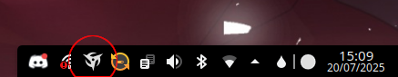

# Ninjutso Sora V2 Battery Status Tray Icon
## Introduction
This is a simple tray icon showing the Ninjutso logo which is either clean (working as intended, battery is charged) or it has a coloured circle in the bottom left corner, indicating either medium-low or low battery status by yellow and red. The circle is blue while it is charging. It also shows the battery percentage when hovering over the icon.

 

I started out from the python script found on https://github.com/Fan4Metal/Sora_tray for Windows. Already on Windows I started to simplify it to reduce its memory footprint when compiling it into a single .exe, since I do not like installing all necessary python packages into the system environment. After recently switching to Linux, I realised how much I actually relied on this tool. After I found it too much of a hassle to get the originally used wxPython running in Linux, I fully switched the code to use PyQt6. I also changed the tray icon design to be more in line with the other KDE Plasma tray icons. This is when I also thought that it is a nice idea to use simple coloured circles to indicate when my mouse needs charging.

## Installation
Important: You need the run the following to allow the script to read the HID information.
1. sudo mkdir -p /etc/udev/rules.d/
echo 'KERNEL=="hidraw*", SUBSYSTEM=="hidraw", MODE="0666", TAG+="uaccess", TAG+="udev-acl"' | sudo tee /etc/udev/rules.d/92-viia.rules
2. sudo udevadm control --reload-rules
3. sudo udevadm trigger

The executable file can just be added to autostart in your Linux distro.

## Building
Make sure to get the "hid" library instead of "hidapi" since only that one could find my mouse. For compiling to an executable file, I used pyinstaller using the following command:
pyinstaller --onefile --add-data "res/ninjutso_dfdfdf.ico:res" sora_tray.py

## Settings
By default, this tool only polls every 300 seconds, shows the medium battery warning at 30 % and the low battery warning at 20 %. This can be easily customised in the script.
